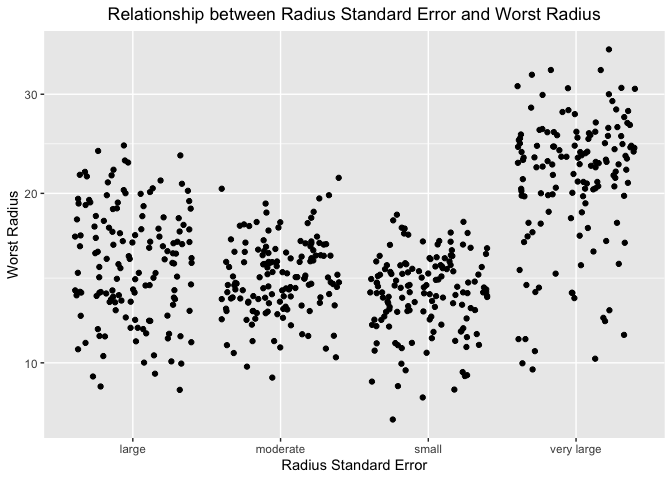
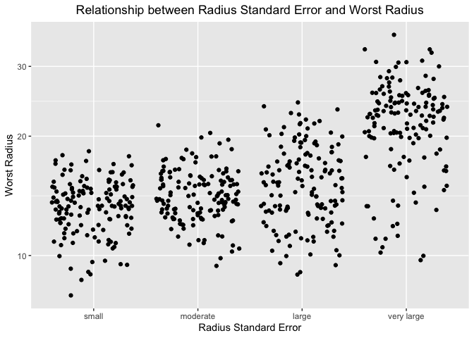
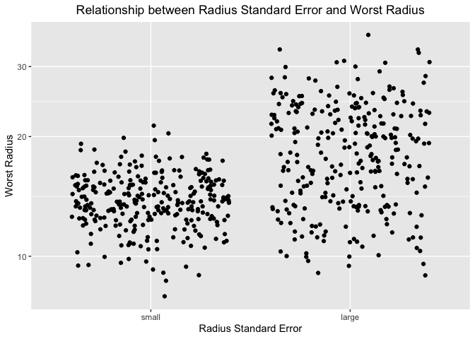

Mini Data Analysis Milestone 2
================

*To complete this milestone, you can edit [this `.rmd`
file](https://raw.githubusercontent.com/UBC-STAT/stat545.stat.ubc.ca/master/content/mini-project/mini-project-2.Rmd)
directly. Fill in the sections that are commented out with
`<!--- start your work here--->`. When you are done, make sure to knit
to an `.md` file by changing the output in the YAML header to
`github_document`, before submitting a tagged release on canvas.*

# Welcome to your second (and last) milestone in your mini data analysis project!

In Milestone 1, you explored your data, came up with research questions,
and obtained some results by making summary tables and graphs. This
time, we will first explore more in depth the concept of *tidy data.*
Then, you’ll be sharpening some of the results you obtained from your
previous milestone by:

- Manipulating special data types in R: factors and/or dates and times.
- Fitting a model object to your data, and extract a result.
- Reading and writing data as separate files.

**NOTE**: The main purpose of the mini data analysis is to integrate
what you learn in class in an analysis. Although each milestone provides
a framework for you to conduct your analysis, it’s possible that you
might find the instructions too rigid for your data set. If this is the
case, you may deviate from the instructions – just make sure you’re
demonstrating a wide range of tools and techniques taught in this class.

# Instructions

**To complete this milestone**, edit [this very `.Rmd`
file](https://raw.githubusercontent.com/UBC-STAT/stat545.stat.ubc.ca/master/content/mini-project/mini-project-2.Rmd)
directly. Fill in the sections that are tagged with
`<!--- start your work here--->`.

**To submit this milestone**, make sure to knit this `.Rmd` file to an
`.md` file by changing the YAML output settings from
`output: html_document` to `output: github_document`. Commit and push
all of your work to your mini-analysis GitHub repository, and tag a
release on GitHub. Then, submit a link to your tagged release on canvas.

**Points**: This milestone is worth 55 points (compared to the 45 points
of the Milestone 1): 45 for your analysis, and 10 for your entire
mini-analysis GitHub repository. Details follow.

**Research Questions**: In Milestone 1, you chose two research questions
to focus on. Wherever realistic, your work in this milestone should
relate to these research questions whenever we ask for justification
behind your work. In the case that some tasks in this milestone don’t
align well with one of your research questions, feel free to discuss
your results in the context of a different research question.

# Learning Objectives

By the end of this milestone, you should:

- Understand what *tidy* data is, and how to create it using `tidyr`.
- Generate a reproducible and clear report using R Markdown.
- Manipulating special data types in R: factors and/or dates and times.
- Fitting a model object to your data, and extract a result.
- Reading and writing data as separate files.

# Setup

Begin by loading your data and the tidyverse package below:

``` r
library(datateachr) # <- might contain the data you picked!
library(tidyverse)
library(dplyr)
```

# Task 1: Tidy your data (15 points)

In this task, we will do several exercises to reshape our data. The goal
here is to understand how to do this reshaping with the `tidyr` package.

A reminder of the definition of *tidy* data:

- Each row is an **observation**
- Each column is a **variable**
- Each cell is a **value**

*Tidy’ing* data is sometimes necessary because it can simplify
computation. Other times it can be nice to organize data so that it can
be easier to understand when read manually.

### 2.1 (2.5 points)

Based on the definition above, can you identify if your data is tidy or
untidy? Go through all your columns, or if you have \>8 variables, just
pick 8, and explain whether the data is untidy or tidy.

<!--------------------------- Start your work below --------------------------->

``` r
glimpse(cancer_sample)
```

    ## Rows: 569
    ## Columns: 32
    ## $ ID                      <dbl> 842302, 842517, 84300903, 84348301, 84358402, …
    ## $ diagnosis               <chr> "M", "M", "M", "M", "M", "M", "M", "M", "M", "…
    ## $ radius_mean             <dbl> 17.990, 20.570, 19.690, 11.420, 20.290, 12.450…
    ## $ texture_mean            <dbl> 10.38, 17.77, 21.25, 20.38, 14.34, 15.70, 19.9…
    ## $ perimeter_mean          <dbl> 122.80, 132.90, 130.00, 77.58, 135.10, 82.57, …
    ## $ area_mean               <dbl> 1001.0, 1326.0, 1203.0, 386.1, 1297.0, 477.1, …
    ## $ smoothness_mean         <dbl> 0.11840, 0.08474, 0.10960, 0.14250, 0.10030, 0…
    ## $ compactness_mean        <dbl> 0.27760, 0.07864, 0.15990, 0.28390, 0.13280, 0…
    ## $ concavity_mean          <dbl> 0.30010, 0.08690, 0.19740, 0.24140, 0.19800, 0…
    ## $ concave_points_mean     <dbl> 0.14710, 0.07017, 0.12790, 0.10520, 0.10430, 0…
    ## $ symmetry_mean           <dbl> 0.2419, 0.1812, 0.2069, 0.2597, 0.1809, 0.2087…
    ## $ fractal_dimension_mean  <dbl> 0.07871, 0.05667, 0.05999, 0.09744, 0.05883, 0…
    ## $ radius_se               <dbl> 1.0950, 0.5435, 0.7456, 0.4956, 0.7572, 0.3345…
    ## $ texture_se              <dbl> 0.9053, 0.7339, 0.7869, 1.1560, 0.7813, 0.8902…
    ## $ perimeter_se            <dbl> 8.589, 3.398, 4.585, 3.445, 5.438, 2.217, 3.18…
    ## $ area_se                 <dbl> 153.40, 74.08, 94.03, 27.23, 94.44, 27.19, 53.…
    ## $ smoothness_se           <dbl> 0.006399, 0.005225, 0.006150, 0.009110, 0.0114…
    ## $ compactness_se          <dbl> 0.049040, 0.013080, 0.040060, 0.074580, 0.0246…
    ## $ concavity_se            <dbl> 0.05373, 0.01860, 0.03832, 0.05661, 0.05688, 0…
    ## $ concave_points_se       <dbl> 0.015870, 0.013400, 0.020580, 0.018670, 0.0188…
    ## $ symmetry_se             <dbl> 0.03003, 0.01389, 0.02250, 0.05963, 0.01756, 0…
    ## $ fractal_dimension_se    <dbl> 0.006193, 0.003532, 0.004571, 0.009208, 0.0051…
    ## $ radius_worst            <dbl> 25.38, 24.99, 23.57, 14.91, 22.54, 15.47, 22.8…
    ## $ texture_worst           <dbl> 17.33, 23.41, 25.53, 26.50, 16.67, 23.75, 27.6…
    ## $ perimeter_worst         <dbl> 184.60, 158.80, 152.50, 98.87, 152.20, 103.40,…
    ## $ area_worst              <dbl> 2019.0, 1956.0, 1709.0, 567.7, 1575.0, 741.6, …
    ## $ smoothness_worst        <dbl> 0.1622, 0.1238, 0.1444, 0.2098, 0.1374, 0.1791…
    ## $ compactness_worst       <dbl> 0.6656, 0.1866, 0.4245, 0.8663, 0.2050, 0.5249…
    ## $ concavity_worst         <dbl> 0.71190, 0.24160, 0.45040, 0.68690, 0.40000, 0…
    ## $ concave_points_worst    <dbl> 0.26540, 0.18600, 0.24300, 0.25750, 0.16250, 0…
    ## $ symmetry_worst          <dbl> 0.4601, 0.2750, 0.3613, 0.6638, 0.2364, 0.3985…
    ## $ fractal_dimension_worst <dbl> 0.11890, 0.08902, 0.08758, 0.17300, 0.07678, 0…

We can see using the glimpse function that each variable is a
measurement and none of them are duplicates so we have that each column
is a variable.

``` r
head(cancer_sample$ID)
```

    ## [1]   842302   842517 84300903 84348301 84358402   843786

``` r
head(cancer_sample$diagnosis)
```

    ## [1] "M" "M" "M" "M" "M" "M"

``` r
head(cancer_sample$radius_mean)
```

    ## [1] 17.99 20.57 19.69 11.42 20.29 12.45

``` r
head(cancer_sample$texture_mean)
```

    ## [1] 10.38 17.77 21.25 20.38 14.34 15.70

``` r
head(cancer_sample$perimeter_mean)
```

    ## [1] 122.80 132.90 130.00  77.58 135.10  82.57

``` r
head(cancer_sample$area_mean)
```

    ## [1] 1001.0 1326.0 1203.0  386.1 1297.0  477.1

``` r
head(cancer_sample$smoothness_mean)
```

    ## [1] 0.11840 0.08474 0.10960 0.14250 0.10030 0.12780

``` r
head(cancer_sample$compactness_mean)
```

    ## [1] 0.27760 0.07864 0.15990 0.28390 0.13280 0.17000

These 8 columns specifically have observations in all cells. All of the
cells were checked but to save space only the first 6 elements of each
are printed here.

``` r
for (i in 2:length(cancer_sample$ID)) {
  if (cancer_sample$ID[i-1]==cancer_sample$ID[i]){print("true")}
}
```

As we can see there are no duplicate ID’s so we can conclude that each
row is an observation.

``` r
head(cancer_sample)
```

    ## # A tibble: 6 × 32
    ##       ID diagn…¹ radiu…² textu…³ perim…⁴ area_…⁵ smoot…⁶ compa…⁷ conca…⁸ conca…⁹
    ##    <dbl> <chr>     <dbl>   <dbl>   <dbl>   <dbl>   <dbl>   <dbl>   <dbl>   <dbl>
    ## 1 8.42e5 M          18.0    10.4   123.    1001   0.118   0.278   0.300   0.147 
    ## 2 8.43e5 M          20.6    17.8   133.    1326   0.0847  0.0786  0.0869  0.0702
    ## 3 8.43e7 M          19.7    21.2   130     1203   0.110   0.160   0.197   0.128 
    ## 4 8.43e7 M          11.4    20.4    77.6    386.  0.142   0.284   0.241   0.105 
    ## 5 8.44e7 M          20.3    14.3   135.    1297   0.100   0.133   0.198   0.104 
    ## 6 8.44e5 M          12.4    15.7    82.6    477.  0.128   0.17    0.158   0.0809
    ## # … with 22 more variables: symmetry_mean <dbl>, fractal_dimension_mean <dbl>,
    ## #   radius_se <dbl>, texture_se <dbl>, perimeter_se <dbl>, area_se <dbl>,
    ## #   smoothness_se <dbl>, compactness_se <dbl>, concavity_se <dbl>,
    ## #   concave_points_se <dbl>, symmetry_se <dbl>, fractal_dimension_se <dbl>,
    ## #   radius_worst <dbl>, texture_worst <dbl>, perimeter_worst <dbl>,
    ## #   area_worst <dbl>, smoothness_worst <dbl>, compactness_worst <dbl>,
    ## #   concavity_worst <dbl>, concave_points_worst <dbl>, symmetry_worst <dbl>, …

Every observation is a value. We have now checked and know that our data
is tidy.

<!----------------------------------------------------------------------------->

### 2.2 (5 points)

Now, if your data is tidy, untidy it! Then, tidy it back to it’s
original state.

If your data is untidy, then tidy it! Then, untidy it back to it’s
original state.

Be sure to explain your reasoning for this task. Show us the “before”
and “after”.

<!--------------------------- Start your work below --------------------------->

``` r
cancer_sample_untidy <- cancer_sample %>%
   pivot_wider(names_from = ID,
                values_from = radius_mean)
cancer_sample_untidy
```

    ## # A tibble: 569 × 599
    ##    diagnosis texture_m…¹ perim…² area_…³ smoot…⁴ compa…⁵ conca…⁶ conca…⁷ symme…⁸
    ##    <chr>           <dbl>   <dbl>   <dbl>   <dbl>   <dbl>   <dbl>   <dbl>   <dbl>
    ##  1 M                10.4   123.    1001   0.118   0.278   0.300   0.147    0.242
    ##  2 M                17.8   133.    1326   0.0847  0.0786  0.0869  0.0702   0.181
    ##  3 M                21.2   130     1203   0.110   0.160   0.197   0.128    0.207
    ##  4 M                20.4    77.6    386.  0.142   0.284   0.241   0.105    0.260
    ##  5 M                14.3   135.    1297   0.100   0.133   0.198   0.104    0.181
    ##  6 M                15.7    82.6    477.  0.128   0.17    0.158   0.0809   0.209
    ##  7 M                20.0   120.    1040   0.0946  0.109   0.113   0.074    0.179
    ##  8 M                20.8    90.2    578.  0.119   0.164   0.0937  0.0598   0.220
    ##  9 M                21.8    87.5    520.  0.127   0.193   0.186   0.0935   0.235
    ## 10 M                24.0    84.0    476.  0.119   0.240   0.227   0.0854   0.203
    ## # … with 559 more rows, 590 more variables: fractal_dimension_mean <dbl>,
    ## #   radius_se <dbl>, texture_se <dbl>, perimeter_se <dbl>, area_se <dbl>,
    ## #   smoothness_se <dbl>, compactness_se <dbl>, concavity_se <dbl>,
    ## #   concave_points_se <dbl>, symmetry_se <dbl>, fractal_dimension_se <dbl>,
    ## #   radius_worst <dbl>, texture_worst <dbl>, perimeter_worst <dbl>,
    ## #   area_worst <dbl>, smoothness_worst <dbl>, compactness_worst <dbl>,
    ## #   concavity_worst <dbl>, concave_points_worst <dbl>, symmetry_worst <dbl>, …

Our data is now untidy as not all the columns are variables, some are
now observations. The new columns are named after the ID observations
and then observations under these columns are radius_mean, the columns
are not variables. Not every cell has a value as lots of cells are now
NA. Now we will tidy it back.

``` r
cancer_sample_tidy <- cancer_sample_untidy %>%
  pivot_longer(cols = c(-diagnosis,-texture_mean,-perimeter_mean,-area_mean,-smoothness_mean,-compactness_mean,-concavity_mean,-concave_points_mean,-symmetry_mean,-fractal_dimension_mean,-radius_se,-texture_se,-perimeter_se,-area_se,-smoothness_se,-compactness_se,-concavity_se,-concave_points_se,-symmetry_se,-fractal_dimension_se,-radius_worst,-texture_worst,-perimeter_worst,-area_worst,-smoothness_worst,-compactness_worst,-concavity_worst,-concave_points_worst,-symmetry_worst,-fractal_dimension_worst),
               names_to  = "ID", 
               values_to = "radius_mean",
               values_drop_na = TRUE)
head(cancer_sample_tidy)
```

    ## # A tibble: 6 × 32
    ##   diagnosis texture_mean perim…¹ area_…² smoot…³ compa…⁴ conca…⁵ conca…⁶ symme…⁷
    ##   <chr>            <dbl>   <dbl>   <dbl>   <dbl>   <dbl>   <dbl>   <dbl>   <dbl>
    ## 1 M                 10.4   123.    1001   0.118   0.278   0.300   0.147    0.242
    ## 2 M                 17.8   133.    1326   0.0847  0.0786  0.0869  0.0702   0.181
    ## 3 M                 21.2   130     1203   0.110   0.160   0.197   0.128    0.207
    ## 4 M                 20.4    77.6    386.  0.142   0.284   0.241   0.105    0.260
    ## 5 M                 14.3   135.    1297   0.100   0.133   0.198   0.104    0.181
    ## 6 M                 15.7    82.6    477.  0.128   0.17    0.158   0.0809   0.209
    ## # … with 23 more variables: fractal_dimension_mean <dbl>, radius_se <dbl>,
    ## #   texture_se <dbl>, perimeter_se <dbl>, area_se <dbl>, smoothness_se <dbl>,
    ## #   compactness_se <dbl>, concavity_se <dbl>, concave_points_se <dbl>,
    ## #   symmetry_se <dbl>, fractal_dimension_se <dbl>, radius_worst <dbl>,
    ## #   texture_worst <dbl>, perimeter_worst <dbl>, area_worst <dbl>,
    ## #   smoothness_worst <dbl>, compactness_worst <dbl>, concavity_worst <dbl>,
    ## #   concave_points_worst <dbl>, symmetry_worst <dbl>, …

Our data is now tidy again.
<!----------------------------------------------------------------------------->

### 2.3 (7.5 points)

Now, you should be more familiar with your data, and also have made
progress in answering your research questions. Based on your interest,
and your analyses, pick 2 of the 4 research questions to continue your
analysis in the next four tasks:

<!-------------------------- Start your work below ---------------------------->

1.  What’s the relationship between the worst or largest measurements of
    each variable and the diagnosis?  
2.  Does the magnitude of the standard error of a variable affect how
    well that variable predicts the diagnosis?  

<!----------------------------------------------------------------------------->

Explain your decision for choosing the above two research questions.

<!--------------------------- Start your work below --------------------------->

I chose these two research questions as they are not as specific as the
other two so I think they will provide interesting results. I can create
models from our data that can further our understanding and help answer
the two questions I selected. I also think they are important questions
to ask when researching data such as this, as we may be able to conclude
that some of the measurements don’t predict diagnosis well. Eliminating
these measurements could save time and reduce the cost when looking at
the sample image and still lead to an accurate diagnosis.
<!----------------------------------------------------------------------------->

Now, try to choose a version of your data that you think will be
appropriate to answer these 2 questions. Use between 4 and 8 functions
that we’ve covered so far (i.e. by filtering, cleaning, tidy’ing,
dropping irrelevant columns, etc.).

<!--------------------------- Start your work below --------------------------->

``` r
cancer_sample_1 <- cancer_sample %>%
  select(c(ID:diagnosis, ends_with("se"), ends_with("worst")))
cancer_sample_2 <- arrange(cancer_sample_1, diagnosis)
cancer_sample_3 <- rename(cancer_sample_2, frac_dim_se=fractal_dimension_se)
cancer_sample_4 <- rename(cancer_sample_3, frac_dim_worst = fractal_dimension_worst)
cancer_sample_5 <- rename(cancer_sample_4, conc_pts_se=concave_points_se)
cancer_sample_6 <- rename(cancer_sample_5, conc_pts_worst = concave_points_worst)
for(i in 1:length(cancer_sample_6$diagnosis)){
  if(cancer_sample_6$diagnosis[i] == "B"){cancer_sample_6$diagnosis[i]=0}
  else{cancer_sample_6$diagnosis[i]=1}
}
cancer_sample_6$diagnosis <- as.numeric(as.character(cancer_sample_6$diagnosis))
glimpse(cancer_sample_6)
```

    ## Rows: 569
    ## Columns: 22
    ## $ ID                <dbl> 8510426, 8510653, 8510824, 854941, 85713702, 857155,…
    ## $ diagnosis         <dbl> 0, 0, 0, 0, 0, 0, 0, 0, 0, 0, 0, 0, 0, 0, 0, 0, 0, 0…
    ## $ radius_se         <dbl> 0.2699, 0.1852, 0.2773, 0.1839, 0.1563, 0.2636, 0.23…
    ## $ texture_se        <dbl> 0.7886, 0.7477, 0.9768, 2.3420, 0.9567, 0.7294, 1.35…
    ## $ perimeter_se      <dbl> 2.058, 1.383, 1.909, 1.170, 1.094, 1.848, 1.735, 2.6…
    ## $ area_se           <dbl> 23.560, 14.670, 15.700, 14.160, 8.205, 19.870, 20.20…
    ## $ smoothness_se     <dbl> 0.008462, 0.004097, 0.009606, 0.004352, 0.008968, 0.…
    ## $ compactness_se    <dbl> 0.014600, 0.018980, 0.014320, 0.004899, 0.016460, 0.…
    ## $ concavity_se      <dbl> 0.023870, 0.016980, 0.019850, 0.013430, 0.015880, 0.…
    ## $ conc_pts_se       <dbl> 0.013150, 0.006490, 0.014210, 0.011640, 0.005917, 0.…
    ## $ symmetry_se       <dbl> 0.01980, 0.01678, 0.02027, 0.02671, 0.02574, 0.01428…
    ## $ frac_dim_se       <dbl> 0.002300, 0.002425, 0.002968, 0.001777, 0.002582, 0.…
    ## $ radius_worst      <dbl> 15.110, 14.500, 10.230, 13.300, 8.964, 13.760, 15.15…
    ## $ texture_worst     <dbl> 19.26, 20.49, 15.66, 22.81, 21.96, 20.70, 31.82, 25.…
    ## $ perimeter_worst   <dbl> 99.70, 96.09, 65.13, 84.46, 57.26, 89.88, 99.00, 82.…
    ## $ area_worst        <dbl> 711.2, 630.5, 314.9, 545.9, 242.2, 582.6, 698.8, 516…
    ## $ smoothness_worst  <dbl> 0.14400, 0.13120, 0.13240, 0.09701, 0.12970, 0.14940…
    ## $ compactness_worst <dbl> 0.17730, 0.27760, 0.11480, 0.04619, 0.13570, 0.21560…
    ## $ concavity_worst   <dbl> 0.239000, 0.189000, 0.088670, 0.048330, 0.068800, 0.…
    ## $ conc_pts_worst    <dbl> 0.12880, 0.07283, 0.06227, 0.05013, 0.02564, 0.06548…
    ## $ symmetry_worst    <dbl> 0.2977, 0.3184, 0.2450, 0.1987, 0.3105, 0.2747, 0.28…
    ## $ frac_dim_worst    <dbl> 0.07259, 0.08183, 0.07773, 0.06169, 0.07409, 0.08301…

This data doesn’t have any irrelevant columns that aren’t necessary for
the research questions I selected and it renames some of the longer
variables so that they are easier to work with. It’s also rearranged by
diagnosis so that the two types of tumors are grouped and can be looked
at separately. I also changed the diagnosis variable to be binary, ie
take on values of 0 and 1. This is common as it can now be used as a
binary response variable in a logistic model. Benign takes on a value of
0, and malignant is 1.
<!----------------------------------------------------------------------------->

# Task 2: Special Data Types (10)

For this exercise, you’ll be choosing two of the three tasks below –
both tasks that you choose are worth 5 points each.

But first, tasks 1 and 2 below ask you to modify a plot you made in a
previous milestone. The plot you choose should involve plotting across
at least three groups (whether by facetting, or using an aesthetic like
colour). Place this plot below (you’re allowed to modify the plot if
you’d like). If you don’t have such a plot, you’ll need to make one.
Place the code for your plot below.

<!-------------------------- Start your work below ---------------------------->

I had a plot with factored levels of smoothness_mean however, that
variable is not in our new version of the data. Therefore I’ll create a
new plot in order to perform tasks 1 and 2. Here the categories for
radius_se are decided using the first quantile, median and third
quantile.

``` r
summary(cancer_sample$radius_se)
```

    ##    Min. 1st Qu.  Median    Mean 3rd Qu.    Max. 
    ##  0.1115  0.2324  0.3242  0.4052  0.4789  2.8730

``` r
cancer_sample_7 <- cancer_sample %>% 
  mutate(radius_se_cat = case_when(radius_se <= 0.2324 ~ "small", 
                              radius_se > 0.2324 & radius_se <=0.3242 ~ "moderate",
                              radius_se >0.3242 & radius_se <=0.4789 ~ "large", 
                              radius_se > 0.4789 ~ "very large"))
ggplot(cancer_sample_7, aes(radius_se_cat, radius_worst)) +
  geom_jitter() +
  scale_y_log10() +
  labs(x="Radius Standard Error", y="Worst Radius", title="Relationship between Radius Standard Error and Worst Radius") +
  theme(plot.title = element_text(hjust = 0.5))
```

<!-- -->
<!----------------------------------------------------------------------------->

Now, choose two of the following tasks.

1.  Produce a new plot that reorders a factor in your original plot,
    using the `forcats` package (3 points). Then, in a sentence or two,
    briefly explain why you chose this ordering (1 point here for
    demonstrating understanding of the reordering, and 1 point for
    demonstrating some justification for the reordering, which could be
    subtle or speculative.)

2.  Produce a new plot that groups some factor levels together into an
    “other” category (or something similar), using the `forcats` package
    (3 points). Then, in a sentence or two, briefly explain why you
    chose this grouping (1 point here for demonstrating understanding of
    the grouping, and 1 point for demonstrating some justification for
    the grouping, which could be subtle or speculative.)

3.  If your data has some sort of time-based column like a date (but
    something more granular than just a year):

    1.  Make a new column that uses a function from the `lubridate` or
        `tsibble` package to modify your original time-based column. (3
        points)

        - Note that you might first have to *make* a time-based column
          using a function like `ymd()`, but this doesn’t count.
        - Examples of something you might do here: extract the day of
          the year from a date, or extract the weekday, or let 24 hours
          elapse on your dates.

    2.  Then, in a sentence or two, explain how your new column might be
        useful in exploring a research question. (1 point for
        demonstrating understanding of the function you used, and 1
        point for your justification, which could be subtle or
        speculative).

        - For example, you could say something like “Investigating the
          day of the week might be insightful because penguins don’t
          work on weekends, and so may respond differently”.

<!-------------------------- Start your work below ---------------------------->

**Task Number**: 1

``` r
ggplot(cancer_sample_7, aes(fct_reorder(radius_se_cat, radius_se), radius_worst)) +
  geom_jitter() +
  scale_y_log10() +
  labs(x="Radius Standard Error", y="Worst Radius", title="Relationship between Radius Standard Error and Worst Radius") +
  theme(plot.title = element_text(hjust = 0.5))
```

<!-- --> I
reordered the plot so that the x axis (radius standard error) was
increasing in size from left to right. A lower standard error is
generally better as it leads to more accurate results. By reordering our
standard error this way we are able to see how increasing the standard
error of the radius affects the worst radius measure. This could help us
possibly look for any outliers in the data.

<!----------------------------------------------------------------------------->
<!-------------------------- Start your work below ---------------------------->

**Task Number**: 2

``` r
radius_se_cat_2 <-  fct_collapse(cancer_sample_7$radius_se_cat, small = c("small","moderate"), large = c("large","very large"))

ggplot(cancer_sample_7, aes(fct_reorder(radius_se_cat_2, radius_se), radius_worst)) +
  geom_jitter() +
  scale_y_log10() +
  labs(x="Radius Standard Error", y="Worst Radius", title="Relationship between Radius Standard Error and Worst Radius") +
  theme(plot.title = element_text(hjust = 0.5))
```

<!-- -->
Since there wasn’t much of a difference between small and moderate I
grouped them together into a new level called small. I then decided to
also group large and very large together so that the number of
observations in each group would be equal. They are now split into two
groups depending on whether the radius standard error is smaller or
larger than the median value of all observations.
<!----------------------------------------------------------------------------->

# Task 3: Modelling

## 2.0 (no points)

Pick a research question, and pick a variable of interest (we’ll call it
“Y”) that’s relevant to the research question. Indicate these.

<!-------------------------- Start your work below ---------------------------->

**Research Question**: 2

**Variable of interest**: diagnosis

<!----------------------------------------------------------------------------->

## 2.1 (5 points)

Fit a model or run a hypothesis test that provides insight on this
variable with respect to the research question. Store the model object
as a variable, and print its output to screen. We’ll omit having to
justify your choice, because we don’t expect you to know about model
specifics in STAT 545.

- **Note**: It’s OK if you don’t know how these models/tests work. Here
  are some examples of things you can do here, but the sky’s the limit.

  - You could fit a model that makes predictions on Y using another
    variable, by using the `lm()` function.
  - You could test whether the mean of Y equals 0 using `t.test()`, or
    maybe the mean across two groups are different using `t.test()`, or
    maybe the mean across multiple groups are different using `anova()`
    (you may have to pivot your data for the latter two).
  - You could use `lm()` to test for significance of regression.

<!-------------------------- Start your work below ---------------------------->

``` r
model <- glm(diagnosis~radius_se + texture_se + perimeter_se + area_se + smoothness_se + compactness_se + concavity_se + conc_pts_se + symmetry_se + frac_dim_se, data=cancer_sample_6, family=binomial())
```

    ## Warning: glm.fit: fitted probabilities numerically 0 or 1 occurred

``` r
model
```

    ## 
    ## Call:  glm(formula = diagnosis ~ radius_se + texture_se + perimeter_se + 
    ##     area_se + smoothness_se + compactness_se + concavity_se + 
    ##     conc_pts_se + symmetry_se + frac_dim_se, family = binomial(), 
    ##     data = cancer_sample_6)
    ## 
    ## Coefficients:
    ##    (Intercept)       radius_se      texture_se    perimeter_se         area_se  
    ##       -3.39225       -28.22915        -0.33386         0.07511         0.39346  
    ##  smoothness_se  compactness_se    concavity_se     conc_pts_se     symmetry_se  
    ##        4.19959        57.25377         3.61415        39.76686        -6.76193  
    ##    frac_dim_se  
    ##     -318.73330  
    ## 
    ## Degrees of Freedom: 568 Total (i.e. Null);  558 Residual
    ## Null Deviance:       751.4 
    ## Residual Deviance: 265.9     AIC: 287.9

<!----------------------------------------------------------------------------->

## 2.2 (5 points)

Produce something relevant from your fitted model: either predictions on
Y, or a single value like a regression coefficient or a p-value.

- Be sure to indicate in writing what you chose to produce.
- Your code should either output a tibble (in which case you should
  indicate the column that contains the thing you’re looking for), or
  the thing you’re looking for itself.
- Obtain your results using the `broom` package if possible. If your
  model is not compatible with the broom function you’re needing, then
  you can obtain your results by some other means, but first indicate
  which broom function is not compatible.

<!-------------------------- Start your work below ---------------------------->

``` r
#cancer_sample_6$y_pred = predict(model, cancer_sample_6, type="response")
#cancer_sample_6 <- cancer_sample_6 %>% select(ID, diagnosis, y_pred, everything())
#cancer_sample_6
broom::tidy(model)
```

    ## # A tibble: 11 × 5
    ##    term            estimate std.error statistic  p.value
    ##    <chr>              <dbl>     <dbl>     <dbl>    <dbl>
    ##  1 (Intercept)      -3.39      0.636    -5.34   9.53e- 8
    ##  2 radius_se       -28.2       6.14     -4.60   4.24e- 6
    ##  3 texture_se       -0.334     0.423    -0.789  4.30e- 1
    ##  4 perimeter_se      0.0751    0.476     0.158  8.75e- 1
    ##  5 area_se           0.393     0.0571    6.89   5.55e-12
    ##  6 smoothness_se     4.20     98.7       0.0426 9.66e- 1
    ##  7 compactness_se   57.3      28.7       2.00   4.60e- 2
    ##  8 concavity_se      3.61     12.0       0.302  7.62e- 1
    ##  9 conc_pts_se      39.8      64.2       0.620  5.35e- 1
    ## 10 symmetry_se      -6.76     30.5      -0.222  8.24e- 1
    ## 11 frac_dim_se    -319.      149.       -2.13   3.28e- 2

I chose to produce the p-values for each coefficient in our model. I can
look at the p-values to decide if any covariates can be dropped and see
which have a significant effect on predicting diagnosis.

<!----------------------------------------------------------------------------->

# Task 4: Reading and writing data

Get set up for this exercise by making a folder called `output` in the
top level of your project folder / repository. You’ll be saving things
there.

## 3.1 (5 points)

Take a summary table that you made from Milestone 1 (Task 4.2), and
write it as a csv file in your `output` folder. Use the `here::here()`
function.

- **Robustness criteria**: You should be able to move your Mini Project
  repository / project folder to some other location on your computer,
  or move this very Rmd file to another location within your project
  repository / folder, and your code should still work.
- **Reproducibility criteria**: You should be able to delete the csv
  file, and remake it simply by knitting this Rmd file.

<!-------------------------- Start your work below ---------------------------->

``` r
here::here()
```

    ## [1] "/Users/charlotteedgar/Documents/STAT545A/CharlotteEdgar-MiniDataAnalysis"

``` r
dir.create(here::here("output"))
```

    ## Warning in dir.create(here::here("output")): '/Users/charlotteedgar/Documents/
    ## STAT545A/CharlotteEdgar-MiniDataAnalysis/output' already exists

``` r
summary_table <- cancer_sample %>% 
 group_by(diagnosis) %>% 
 summarise( n = n())
write_csv(summary_table, here::here("output", "summary_table.csv"))
```

<!----------------------------------------------------------------------------->

## 3.2 (5 points)

Write your model object from Task 3 to an R binary file (an RDS), and
load it again. Be sure to save the binary file in your `output` folder.
Use the functions `saveRDS()` and `readRDS()`.

- The same robustness and reproducibility criteria as in 3.1 apply here.

<!-------------------------- Start your work below ---------------------------->

``` r
saveRDS(model, here::here("output", "model"))
readRDS(here::here("output","model"))
```

    ## 
    ## Call:  glm(formula = diagnosis ~ radius_se + texture_se + perimeter_se + 
    ##     area_se + smoothness_se + compactness_se + concavity_se + 
    ##     conc_pts_se + symmetry_se + frac_dim_se, family = binomial(), 
    ##     data = cancer_sample_6)
    ## 
    ## Coefficients:
    ##    (Intercept)       radius_se      texture_se    perimeter_se         area_se  
    ##       -3.39225       -28.22915        -0.33386         0.07511         0.39346  
    ##  smoothness_se  compactness_se    concavity_se     conc_pts_se     symmetry_se  
    ##        4.19959        57.25377         3.61415        39.76686        -6.76193  
    ##    frac_dim_se  
    ##     -318.73330  
    ## 
    ## Degrees of Freedom: 568 Total (i.e. Null);  558 Residual
    ## Null Deviance:       751.4 
    ## Residual Deviance: 265.9     AIC: 287.9

<!----------------------------------------------------------------------------->

# Tidy Repository

Now that this is your last milestone, your entire project repository
should be organized. Here are the criteria we’re looking for.

## Main README (3 points)

There should be a file named `README.md` at the top level of your
repository. Its contents should automatically appear when you visit the
repository on GitHub.

Minimum contents of the README file:

- In a sentence or two, explains what this repository is, so that
  future-you or someone else stumbling on your repository can be
  oriented to the repository.
- In a sentence or two (or more??), briefly explains how to engage with
  the repository. You can assume the person reading knows the material
  from STAT 545A. Basically, if a visitor to your repository wants to
  explore your project, what should they know?

Once you get in the habit of making README files, and seeing more README
files in other projects, you’ll wonder how you ever got by without them!
They are tremendously helpful.

## File and Folder structure (3 points)

You should have at least four folders in the top level of your
repository: one for each milestone, and one output folder. If there are
any other folders, these are explained in the main README.

Each milestone document is contained in its respective folder, and
nowhere else.

Every level-1 folder (that is, the ones stored in the top level, like
“Milestone1” and “output”) has a `README` file, explaining in a sentence
or two what is in the folder, in plain language (it’s enough to say
something like “This folder contains the source for Milestone 1”).

## Output (2 points)

All output is recent and relevant:

- All Rmd files have been `knit`ted to their output, and all data files
  saved from Task 4 above appear in the `output` folder.
- All of these output files are up-to-date – that is, they haven’t
  fallen behind after the source (Rmd) files have been updated.
- There should be no relic output files. For example, if you were
  knitting an Rmd to html, but then changed the output to be only a
  markdown file, then the html file is a relic and should be deleted.

Our recommendation: delete all output files, and re-knit each
milestone’s Rmd file, so that everything is up to date and relevant.

PS: there’s a way where you can run all project code using a single
command, instead of clicking “knit” three times. More on this in STAT
545B!

## Error-free code (1 point)

This Milestone 1 document knits error-free, and the Milestone 2 document
knits error-free.

## Tagged release (1 point)

You’ve tagged a release for Milestone 1, and you’ve tagged a release for
Milestone 2.

### Attribution

Thanks to Victor Yuan for mostly putting this together.
