Mini Data-Analysis Deliverable 1
================

# Welcome to your (maybe) first-ever data analysis project!

And hopefully the first of many. Let’s get started:

1.  Install the [`datateachr`](https://github.com/UBC-MDS/datateachr)
    package by typing the following into your **R terminal**:

<!-- -->

    install.packages("devtools")
    devtools::install_github("UBC-MDS/datateachr")

2.  Load the packages below.

``` r
library(datateachr)
library(tidyverse)
```

    ## ── Attaching packages ─────────────────────────────────────── tidyverse 1.3.2 ──
    ## ✔ ggplot2 3.3.6      ✔ purrr   0.3.4 
    ## ✔ tibble  3.1.8      ✔ dplyr   1.0.10
    ## ✔ tidyr   1.2.1      ✔ stringr 1.4.1 
    ## ✔ readr   2.1.2      ✔ forcats 0.5.2 
    ## ── Conflicts ────────────────────────────────────────── tidyverse_conflicts() ──
    ## ✖ dplyr::filter() masks stats::filter()
    ## ✖ dplyr::lag()    masks stats::lag()

3.  Make a repository in the <https://github.com/stat545ubc-2022>
    Organization. You will be working with this repository for the
    entire data analysis project. You can either make it public, or make
    it private and add the TA’s and Lucy as collaborators. A link to
    help you create a private repository is available on the
    \#collaborative-project Slack channel.

# Instructions

## For Both Milestones

-   Each milestone is worth 45 points. The number of points allocated to
    each task will be annotated within each deliverable. Tasks that are
    more challenging will often be allocated more points.

-   10 points will be allocated to the reproducibility, cleanliness, and
    coherence of the overall analysis. While the two milestones will be
    submitted as independent deliverables, the analysis itself is a
    continuum - think of it as two chapters to a story. Each chapter, or
    in this case, portion of your analysis, should be easily followed
    through by someone unfamiliar with the content.
    [Here](https://swcarpentry.github.io/r-novice-inflammation/06-best-practices-R/)
    is a good resource for what constitutes “good code”. Learning good
    coding practices early in your career will save you hassle later on!

## For Milestone 1

**To complete this milestone**, edit [this very `.Rmd`
file](https://raw.githubusercontent.com/UBC-STAT/stat545.stat.ubc.ca/master/content/mini-project/mini-project-1.Rmd)
directly. Fill in the sections that are tagged with
`<!--- start your work below --->`.

**To submit this milestone**, make sure to knit this `.Rmd` file to an
`.md` file by changing the YAML output settings from
`output: html_document` to `output: github_document`. Commit and push
all of your work to the mini-analysis GitHub repository you made
earlier, and tag a release on GitHub. Then, submit a link to your tagged
release on canvas.

**Points**: This milestone is worth 45 points: 43 for your analysis, 1
point for having your Milestone 1 document knit error-free, and 1 point
for tagging your release on Github.

# Learning Objectives

By the end of this milestone, you should:

-   Become familiar with your dataset of choosing
-   Select 4 questions that you would like to answer with your data
-   Generate a reproducible and clear report using R Markdown
-   Become familiar with manipulating and summarizing your data in
    tibbles using `dplyr`, with a research question in mind.

# Task 1: Choose your favorite dataset (10 points)

The `datateachr` package by Hayley Boyce and Jordan Bourak currently
composed of 7 semi-tidy datasets for educational purposes. Here is a
brief description of each dataset:

-   *apt_buildings*: Acquired courtesy of The City of Toronto’s Open
    Data Portal. It currently has 3455 rows and 37 columns.

-   *building_permits*: Acquired courtesy of The City of Vancouver’s
    Open Data Portal. It currently has 20680 rows and 14 columns.

-   *cancer_sample*: Acquired courtesy of UCI Machine Learning
    Repository. It currently has 569 rows and 32 columns.

-   *flow_sample*: Acquired courtesy of The Government of Canada’s
    Historical Hydrometric Database. It currently has 218 rows and 7
    columns.

-   *parking_meters*: Acquired courtesy of The City of Vancouver’s Open
    Data Portal. It currently has 10032 rows and 22 columns.

-   *steam_games*: Acquired courtesy of Kaggle. It currently has 40833
    rows and 21 columns.

-   *vancouver_trees*: Acquired courtesy of The City of Vancouver’s Open
    Data Portal. It currently has 146611 rows and 20 columns.

**Things to keep in mind**

-   We hope that this project will serve as practice for carrying our
    your own *independent* data analysis. Remember to comment your code,
    be explicit about what you are doing, and write notes in this
    markdown document when you feel that context is required. As you
    advance in the project, prompts and hints to do this will be
    diminished - it’ll be up to you!

-   Before choosing a dataset, you should always keep in mind **your
    goal**, or in other ways, *what you wish to achieve with this data*.
    This mini data-analysis project focuses on *data wrangling*,
    *tidying*, and *visualization*. In short, it’s a way for you to get
    your feet wet with exploring data on your own.

And that is exactly the first thing that you will do!

1.1 Out of the 7 datasets available in the `datateachr` package, choose
**4** that appeal to you based on their description. Write your choices
below:

**Note**: We encourage you to use the ones in the `datateachr` package,
but if you have a dataset that you’d really like to use, you can include
it here. But, please check with a member of the teaching team to see
whether the dataset is of appropriate complexity. Also, include a
**brief** description of the dataset here to help the teaching team
understand your data.

<!-------------------------- Start your work below ---------------------------->

1: cancer_sample  
2: vancouver_trees  
3: apt_buildings  
4: flow_sample  

<!----------------------------------------------------------------------------->

1.2 One way to narrowing down your selection is to *explore* the
datasets. Use your knowledge of dplyr to find out at least *3*
attributes about each of these datasets (an attribute is something such
as number of rows, variables, class type…). The goal here is to have an
idea of *what the data looks like*.

*Hint:* This is one of those times when you should think about the
cleanliness of your analysis. I added a single code chunk for you below,
but do you want to use more than one? Would you like to write more
comments outside of the code chunk?

<!-------------------------- Start your work below ---------------------------->

``` r
glimpse(cancer_sample)
```

    ## Rows: 569
    ## Columns: 32
    ## $ ID                      <dbl> 842302, 842517, 84300903, 84348301, 84358402, …
    ## $ diagnosis               <chr> "M", "M", "M", "M", "M", "M", "M", "M", "M", "…
    ## $ radius_mean             <dbl> 17.990, 20.570, 19.690, 11.420, 20.290, 12.450…
    ## $ texture_mean            <dbl> 10.38, 17.77, 21.25, 20.38, 14.34, 15.70, 19.9…
    ## $ perimeter_mean          <dbl> 122.80, 132.90, 130.00, 77.58, 135.10, 82.57, …
    ## $ area_mean               <dbl> 1001.0, 1326.0, 1203.0, 386.1, 1297.0, 477.1, …
    ## $ smoothness_mean         <dbl> 0.11840, 0.08474, 0.10960, 0.14250, 0.10030, 0…
    ## $ compactness_mean        <dbl> 0.27760, 0.07864, 0.15990, 0.28390, 0.13280, 0…
    ## $ concavity_mean          <dbl> 0.30010, 0.08690, 0.19740, 0.24140, 0.19800, 0…
    ## $ concave_points_mean     <dbl> 0.14710, 0.07017, 0.12790, 0.10520, 0.10430, 0…
    ## $ symmetry_mean           <dbl> 0.2419, 0.1812, 0.2069, 0.2597, 0.1809, 0.2087…
    ## $ fractal_dimension_mean  <dbl> 0.07871, 0.05667, 0.05999, 0.09744, 0.05883, 0…
    ## $ radius_se               <dbl> 1.0950, 0.5435, 0.7456, 0.4956, 0.7572, 0.3345…
    ## $ texture_se              <dbl> 0.9053, 0.7339, 0.7869, 1.1560, 0.7813, 0.8902…
    ## $ perimeter_se            <dbl> 8.589, 3.398, 4.585, 3.445, 5.438, 2.217, 3.18…
    ## $ area_se                 <dbl> 153.40, 74.08, 94.03, 27.23, 94.44, 27.19, 53.…
    ## $ smoothness_se           <dbl> 0.006399, 0.005225, 0.006150, 0.009110, 0.0114…
    ## $ compactness_se          <dbl> 0.049040, 0.013080, 0.040060, 0.074580, 0.0246…
    ## $ concavity_se            <dbl> 0.05373, 0.01860, 0.03832, 0.05661, 0.05688, 0…
    ## $ concave_points_se       <dbl> 0.015870, 0.013400, 0.020580, 0.018670, 0.0188…
    ## $ symmetry_se             <dbl> 0.03003, 0.01389, 0.02250, 0.05963, 0.01756, 0…
    ## $ fractal_dimension_se    <dbl> 0.006193, 0.003532, 0.004571, 0.009208, 0.0051…
    ## $ radius_worst            <dbl> 25.38, 24.99, 23.57, 14.91, 22.54, 15.47, 22.8…
    ## $ texture_worst           <dbl> 17.33, 23.41, 25.53, 26.50, 16.67, 23.75, 27.6…
    ## $ perimeter_worst         <dbl> 184.60, 158.80, 152.50, 98.87, 152.20, 103.40,…
    ## $ area_worst              <dbl> 2019.0, 1956.0, 1709.0, 567.7, 1575.0, 741.6, …
    ## $ smoothness_worst        <dbl> 0.1622, 0.1238, 0.1444, 0.2098, 0.1374, 0.1791…
    ## $ compactness_worst       <dbl> 0.6656, 0.1866, 0.4245, 0.8663, 0.2050, 0.5249…
    ## $ concavity_worst         <dbl> 0.71190, 0.24160, 0.45040, 0.68690, 0.40000, 0…
    ## $ concave_points_worst    <dbl> 0.26540, 0.18600, 0.24300, 0.25750, 0.16250, 0…
    ## $ symmetry_worst          <dbl> 0.4601, 0.2750, 0.3613, 0.6638, 0.2364, 0.3985…
    ## $ fractal_dimension_worst <dbl> 0.11890, 0.08902, 0.08758, 0.17300, 0.07678, 0…

``` r
class(cancer_sample)
```

    ## [1] "spec_tbl_df" "tbl_df"      "tbl"         "data.frame"

The cancer_sample dataset has 569 rows and 32 columns. Most of the
variables are numeric (dbl) except for diagnosis which is of the
character type. The dataset is of the tbl_df class meaning the structure
of this data is a tibble.

``` r
glimpse(vancouver_trees)
```

    ## Rows: 146,611
    ## Columns: 20
    ## $ tree_id            <dbl> 149556, 149563, 149579, 149590, 149604, 149616, 149…
    ## $ civic_number       <dbl> 494, 450, 4994, 858, 5032, 585, 4909, 4925, 4969, 7…
    ## $ std_street         <chr> "W 58TH AV", "W 58TH AV", "WINDSOR ST", "E 39TH AV"…
    ## $ genus_name         <chr> "ULMUS", "ZELKOVA", "STYRAX", "FRAXINUS", "ACER", "…
    ## $ species_name       <chr> "AMERICANA", "SERRATA", "JAPONICA", "AMERICANA", "C…
    ## $ cultivar_name      <chr> "BRANDON", NA, NA, "AUTUMN APPLAUSE", NA, "CHANTICL…
    ## $ common_name        <chr> "BRANDON ELM", "JAPANESE ZELKOVA", "JAPANESE SNOWBE…
    ## $ assigned           <chr> "N", "N", "N", "Y", "N", "N", "N", "N", "N", "N", "…
    ## $ root_barrier       <chr> "N", "N", "N", "N", "N", "N", "N", "N", "N", "N", "…
    ## $ plant_area         <chr> "N", "N", "4", "4", "4", "B", "6", "6", "3", "3", "…
    ## $ on_street_block    <dbl> 400, 400, 4900, 800, 5000, 500, 4900, 4900, 4900, 7…
    ## $ on_street          <chr> "W 58TH AV", "W 58TH AV", "WINDSOR ST", "E 39TH AV"…
    ## $ neighbourhood_name <chr> "MARPOLE", "MARPOLE", "KENSINGTON-CEDAR COTTAGE", "…
    ## $ street_side_name   <chr> "EVEN", "EVEN", "EVEN", "EVEN", "EVEN", "ODD", "ODD…
    ## $ height_range_id    <dbl> 2, 4, 3, 4, 2, 2, 3, 3, 2, 2, 2, 5, 3, 2, 2, 2, 2, …
    ## $ diameter           <dbl> 10.00, 10.00, 4.00, 18.00, 9.00, 5.00, 15.00, 14.00…
    ## $ curb               <chr> "N", "N", "Y", "Y", "Y", "Y", "Y", "Y", "Y", "Y", "…
    ## $ date_planted       <date> 1999-01-13, 1996-05-31, 1993-11-22, 1996-04-29, 19…
    ## $ longitude          <dbl> -123.1161, -123.1147, -123.0846, -123.0870, -123.08…
    ## $ latitude           <dbl> 49.21776, 49.21776, 49.23938, 49.23469, 49.23894, 4…

``` r
class(vancouver_trees)
```

    ## [1] "tbl_df"     "tbl"        "data.frame"

The vancouver_trees dataset has 146,611 rows and 20 columns. There’s a
variety of variable types including numeric (dbl), character and date.
This dataset is also a tibble.

``` r
glimpse(apt_buildings)
```

    ## Rows: 3,455
    ## Columns: 37
    ## $ id                               <dbl> 10359, 10360, 10361, 10362, 10363, 10…
    ## $ air_conditioning                 <chr> "NONE", "NONE", "NONE", "NONE", "NONE…
    ## $ amenities                        <chr> "Outdoor rec facilities", "Outdoor po…
    ## $ balconies                        <chr> "YES", "YES", "YES", "YES", "NO", "NO…
    ## $ barrier_free_accessibilty_entr   <chr> "YES", "NO", "NO", "YES", "NO", "NO",…
    ## $ bike_parking                     <chr> "0 indoor parking spots and 10 outdoo…
    ## $ exterior_fire_escape             <chr> "NO", "NO", "NO", "YES", "NO", NA, "N…
    ## $ fire_alarm                       <chr> "YES", "YES", "YES", "YES", "YES", "Y…
    ## $ garbage_chutes                   <chr> "YES", "YES", "NO", "NO", "NO", "NO",…
    ## $ heating_type                     <chr> "HOT WATER", "HOT WATER", "HOT WATER"…
    ## $ intercom                         <chr> "YES", "YES", "YES", "YES", "YES", "Y…
    ## $ laundry_room                     <chr> "YES", "YES", "YES", "YES", "YES", "Y…
    ## $ locker_or_storage_room           <chr> "NO", "YES", "YES", "YES", "NO", "YES…
    ## $ no_of_elevators                  <dbl> 3, 3, 0, 1, 0, 0, 0, 2, 4, 2, 0, 2, 2…
    ## $ parking_type                     <chr> "Underground Garage , Garage accessib…
    ## $ pets_allowed                     <chr> "YES", "YES", "YES", "YES", "YES", "Y…
    ## $ prop_management_company_name     <chr> NA, "SCHICKEDANZ BROS. PROPERTIES", N…
    ## $ property_type                    <chr> "PRIVATE", "PRIVATE", "PRIVATE", "PRI…
    ## $ rsn                              <dbl> 4154812, 4154815, 4155295, 4155309, 4…
    ## $ separate_gas_meters              <chr> "NO", "NO", "NO", "NO", "NO", "NO", "…
    ## $ separate_hydro_meters            <chr> "YES", "YES", "YES", "YES", "YES", "Y…
    ## $ separate_water_meters            <chr> "NO", "NO", "NO", "NO", "NO", "NO", "…
    ## $ site_address                     <chr> "65  FOREST MANOR RD", "70  CLIPPER R…
    ## $ sprinkler_system                 <chr> "YES", "YES", "NO", "YES", "NO", "NO"…
    ## $ visitor_parking                  <chr> "PAID", "FREE", "UNAVAILABLE", "UNAVA…
    ## $ ward                             <chr> "17", "17", "03", "03", "02", "02", "…
    ## $ window_type                      <chr> "DOUBLE PANE", "DOUBLE PANE", "DOUBLE…
    ## $ year_built                       <dbl> 1967, 1970, 1927, 1959, 1943, 1952, 1…
    ## $ year_registered                  <dbl> 2017, 2017, 2017, 2017, 2017, NA, 201…
    ## $ no_of_storeys                    <dbl> 17, 14, 4, 5, 4, 4, 4, 7, 32, 4, 4, 7…
    ## $ emergency_power                  <chr> "NO", "YES", "NO", "NO", "NO", "NO", …
    ## $ `non-smoking_building`           <chr> "YES", "NO", "YES", "YES", "YES", "NO…
    ## $ no_of_units                      <dbl> 218, 206, 34, 42, 25, 34, 14, 105, 57…
    ## $ no_of_accessible_parking_spaces  <dbl> 8, 10, 20, 42, 12, 0, 5, 1, 1, 6, 12,…
    ## $ facilities_available             <chr> "Recycling bins", "Green Bin / Organi…
    ## $ cooling_room                     <chr> "NO", "NO", "NO", "NO", "NO", "NO", "…
    ## $ no_barrier_free_accessible_units <dbl> 2, 0, 0, 42, 0, NA, 14, 0, 0, 1, 25, …

``` r
class(apt_buildings)
```

    ## [1] "tbl_df"     "tbl"        "data.frame"

The apt_buidlings dataset has 3,455 rows and 37 columns. Most the
variables are of the character type and the rest are numeric (dbl). This
data structure is a tibble.

``` r
glimpse(flow_sample)
```

    ## Rows: 218
    ## Columns: 7
    ## $ station_id   <chr> "05BB001", "05BB001", "05BB001", "05BB001", "05BB001", "0…
    ## $ year         <dbl> 1909, 1910, 1911, 1912, 1913, 1914, 1915, 1916, 1917, 191…
    ## $ extreme_type <chr> "maximum", "maximum", "maximum", "maximum", "maximum", "m…
    ## $ month        <dbl> 7, 6, 6, 8, 6, 6, 6, 6, 6, 6, 6, 7, 6, 6, 6, 7, 5, 7, 6, …
    ## $ day          <dbl> 7, 12, 14, 25, 11, 18, 27, 20, 17, 15, 22, 3, 9, 5, 14, 5…
    ## $ flow         <dbl> 314, 230, 264, 174, 232, 214, 236, 309, 174, 345, 185, 24…
    ## $ sym          <chr> NA, NA, NA, NA, NA, NA, NA, NA, NA, NA, NA, NA, NA, NA, N…

``` r
class(flow_sample)
```

    ## [1] "tbl_df"     "tbl"        "data.frame"

The flow_sample dataset has 218 rows and 7 columns. It consists of
double and character variable types. It’s a tibble.
<!----------------------------------------------------------------------------->

1.3 Now that you’ve explored the 4 datasets that you were initially most
interested in, let’s narrow it down to 2. What lead you to choose these
2? Briefly explain your choices below, and feel free to include any code
in your explanation.

<!-------------------------- Start your work below ---------------------------->

My top two choices of datasets are now flow_sample and cancer_sample. I
chose cancer_sample because it has a lot of numeric variables and it
would be interesting to explore how these measurements differ for benign
and malignant tumors. Also, I have a background in biology so the
possible research questions that this dataset could explore are very
interesting to me. I chose flow_sample because it only has 7 columns so
I think it would be interesting and feasible to explore each variable
individually. It also has both numeric and character variables so we
could explore the different types.
<!----------------------------------------------------------------------------->

1.4 Time for the final decision! Going back to the beginning, it’s
important to have an *end goal* in mind. For example, if I had chosen
the `titanic` dataset for my project, I might’ve wanted to explore the
relationship between survival and other variables. Try to think of 1
research question that you would want to answer with each dataset. Note
them down below, and make your final choice based on what seems more
interesting to you!

<!-------------------------- Start your work below ---------------------------->

For the cancer_sample dataset, I would like to explore the relationship
between the measurable dimensions of the nuclei and the diagnosis of a
tumor. This could help us see how well we can predict the diagnosis
based on the measurements. For the flow_sample dataset, I would like to
explore whether certain months have more extreme flow rates than others.
My final choice is to analyze the cancer_sample dataset.
<!----------------------------------------------------------------------------->

# Important note

Read Tasks 2 and 3 *fully* before starting to complete either of them.
Probably also a good point to grab a coffee to get ready for the fun
part!

This project is semi-guided, but meant to be *independent*. For this
reason, you will complete tasks 2 and 3 below (under the **START HERE**
mark) as if you were writing your own exploratory data analysis report,
and this guidance never existed! Feel free to add a brief introduction
section to your project, format the document with markdown syntax as you
deem appropriate, and structure the analysis as you deem appropriate.
Remember, marks will be awarded for completion of the 4 tasks, but 10
points of the whole project are allocated to a reproducible and clean
analysis. If you feel lost, you can find a sample data analysis
[here](https://www.kaggle.com/headsortails/tidy-titarnic) to have a
better idea. However, bear in mind that it is **just an example** and
you will not be required to have that level of complexity in your
project.

# Task 2: Exploring your dataset (15 points)

If we rewind and go back to the learning objectives, you’ll see that by
the end of this deliverable, you should have formulated *4* research
questions about your data that you may want to answer during your
project. However, it may be handy to do some more exploration on your
dataset of choice before creating these questions - by looking at the
data, you may get more ideas. **Before you start this task, read all
instructions carefully until you reach START HERE under Task 3**.

2.1 Complete *4 out of the following 8 exercises* to dive deeper into
your data. All datasets are different and therefore, not all of these
tasks may make sense for your data - which is why you should only answer
*4*. Use *dplyr* and *ggplot*.

1.  Plot the distribution of a numeric variable.
2.  Create a new variable based on other variables in your data (only if
    it makes sense)
3.  Investigate how many missing values there are per variable. Can you
    find a way to plot this?
4.  Explore the relationship between 2 variables in a plot.
5.  Filter observations in your data according to your own criteria.
    Think of what you’d like to explore - again, if this was the
    `titanic` dataset, I may want to narrow my search down to passengers
    born in a particular year…
6.  Use a boxplot to look at the frequency of different observations
    within a single variable. You can do this for more than one variable
    if you wish!
7.  Make a new tibble with a subset of your data, with variables and
    observations that you are interested in exploring.
8.  Use a density plot to explore any of your variables (that are
    suitable for this type of plot).

2.2 For each of the 4 exercises that you complete, provide a *brief
explanation* of why you chose that exercise in relation to your data (in
other words, why does it make sense to do that?), and sufficient
comments for a reader to understand your reasoning and code.

<!-------------------------- Start your work below ---------------------------->

All of the following plots are created using ggplot2 specifying the
dataset, aesthetic maps and geometric objects. As well as some other
input that will be used to label axes and make the graphs more
presentable.

## Exercise 1

We will start by plotting the distributions of two numeric variables. I
plotted a histogram for the radius_worst and the symmetry_worst
variables to explore the distributions of these two continuous
variables. As you can see in the code, we inputted the cancer_sample
dataset and specified the variables to be radius_worst and
symmetry_worst for the two different plots. Now that the plots are
initialized we can add a layer to add the histogram geom. These plots
show us the distribution of the two continuous variables so that we can
see if the distribution of radius_worst and symmetry_worst is skewed or
symmetric, where the peaks are and if there’s any outliers. I did it for
these worst variable specifically to see how the largest values differ.

``` r
ggplot(cancer_sample, aes(radius_worst)) +
  geom_histogram(bins = 50)+ 
  labs(x="Radius", y = "Count", title="Distribution of the Largest Radius of Nuclei") +
  theme(plot.title = element_text(hjust = 0.5))
```

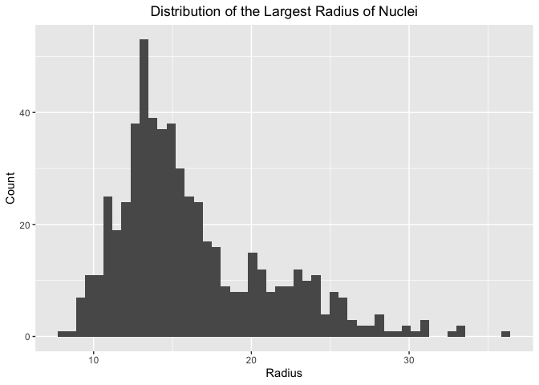<!-- -->

``` r
ggplot(cancer_sample, aes(symmetry_worst)) +
  geom_histogram(bins = 50) + 
  labs(x="Symmetry", y="Count", title="Distribution of the Largest Symmetry of Nuclei")+
  theme(plot.title = element_text(hjust = 0.5))
```

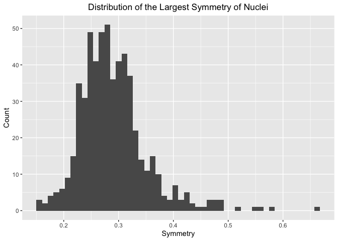<!-- -->

## Exercise 6

Now we will analyze the dataset by making two boxplots. Here we
specified our x variable to be diagnosis which is categorical taking on
values “B” for benign and “M” for malignant. We specified the y variable
to be radius_mean. We then added a layer for the boxplot geom. The
side-by-side boxplots are useful to look at the distribution of
radius_mean for the two different diagnoses. We can compare the ranges
and medians of the radius_mean variable for benign tumors and malignant
tumors. The second boxplot is similar but the y variable is the
smoothness_mean. Again the side-by-side boxplots work well to compare
the two distributions and spot outliers.

``` r
ggplot(cancer_sample, aes(diagnosis, radius_mean)) +
  geom_boxplot() +
  labs(x="Diagnosis",y="Mean radius",title="Distribution of Mean Radius of Nuclei for each Diagnosis ")+
  theme(plot.title = element_text(hjust = 0.5))
```

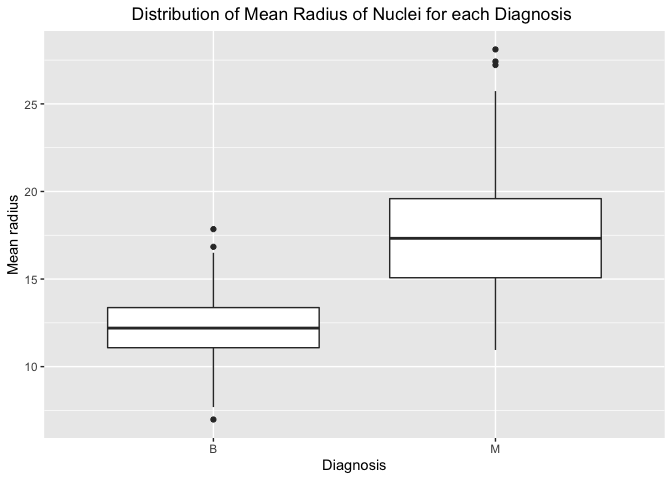<!-- -->

``` r
ggplot(cancer_sample, aes(diagnosis, smoothness_mean)) +
  geom_boxplot() +
  labs(x="Diagnosis",y="Mean smoothness",title="Distribution of Mean Smoothness of Nuclei for each Diagnosis ")+
  theme(plot.title = element_text(hjust = 0.5))
```

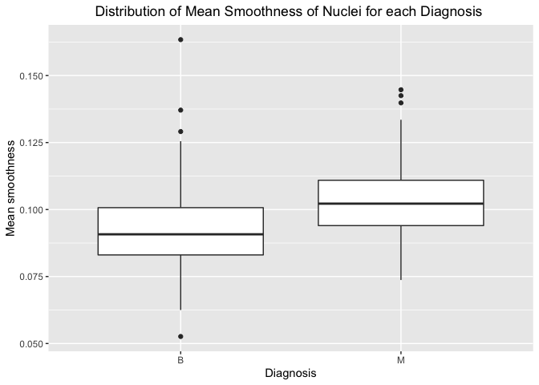<!-- -->

## Exercise 8

Next, we will use a density graph to explore our dataset further. The
graph is created by specifying the area_mean variable to be our x
variable. Then we add a layer to add the density geom. We used the
density graph on the numerical variable area_mean to show the
distribution of this continuous variable. This is useful to see where
the maximum is and the symmetry of the data.

``` r
 ggplot(cancer_sample, aes(area_mean)) +
  geom_density() +
  labs(x="Mean area",y="Density",title="Distribution of Mean Area of Nuclei")  +
  theme(plot.title = element_text(hjust = 0.5))
```

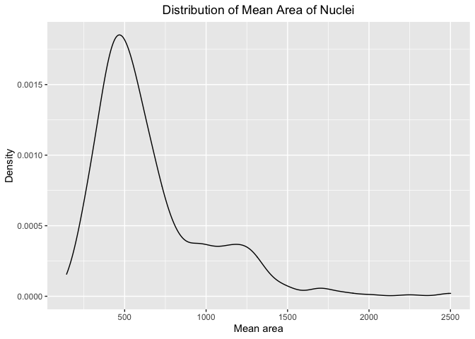<!-- -->

## Exercise 4

Finally, we will use a scatterplot to explore the relationship between
two variables. To do this we had to specify the x and y variables to be
area_mean and area_se respectively, then we added the point geom and
specified the transparency using alpha. This is a useful graph when we
look at the relationship between area_mean and area_se because we can
see how increasing the mean area affects the standard error of this
measurement.

``` r
ggplot(cancer_sample, aes(area_mean, area_se)) +
  geom_point(alpha = 0.1) +
  labs(x="Mean area",y="Standard error of area",title="Relationship between Mean Area of Nuclei and Standard Error of Nuclei")  +
  theme(plot.title = element_text(hjust = 0.5))
```

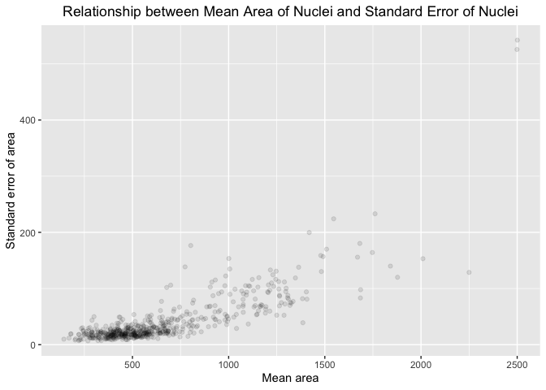<!-- -->

<!----------------------------------------------------------------------------->

# Task 3: Write your research questions (5 points)

So far, you have chosen a dataset and gotten familiar with it through
exploring the data. Now it’s time to figure out 4 research questions
that you would like to answer with your data! Write the 4 questions and
any additional comments at the end of this deliverable. These questions
are not necessarily set in stone - TAs will review them and give you
feedback; therefore, you may choose to pursue them as they are for the
rest of the project, or make modifications!

<!--- *****START HERE***** --->

1.  What is the relationship between the mean perimeter of the nuclei
    and the diagnosis?  
2.  What’s the relationship between the worst or largest measurements of
    each variable and the diagnosis?  
3.  Does the magnitude of the standard error of a variable affect how
    well that variable predicts the diagnosis?  
4.  What is the relationship between the mean area of nuclei and the
    mean smoothness?  

# Task 4: Process and summarize your data (13 points)

From Task 2, you should have an idea of the basic structure of your
dataset (e.g. number of rows and columns, class types, etc.). Here, we
will start investigating your data more in-depth using various data
manipulation functions.

### 1.1 (10 points)

Now, for each of your four research questions, choose one task from
options 1-4 (summarizing), and one other task from 4-8 (graphing). You
should have 2 tasks done for each research question (8 total). Make sure
it makes sense to do them! (e.g. don’t use a numerical variables for a
task that needs a categorical variable.). Comment on why each task helps
(or doesn’t!) answer the corresponding research question.

Ensure that the output of each operation is printed!

**Summarizing:**

1.  Compute the *range*, *mean*, and *two other summary statistics* of
    **one numerical variable** across the groups of **one categorical
    variable** from your data.
2.  Compute the number of observations for at least one of your
    categorical variables. Do not use the function `table()`!
3.  Create a categorical variable with 3 or more groups from an existing
    numerical variable. You can use this new variable in the other
    tasks! *An example: age in years into “child, teen, adult, senior”.*
4.  Based on two categorical variables, calculate two summary statistics
    of your choosing.

**Graphing:**

5.  Create a graph out of summarized variables that has at least two
    geom layers.
6.  Create a graph of your choosing, make one of the axes logarithmic,
    and format the axes labels so that they are “pretty” or easier to
    read.
7.  Make a graph where it makes sense to customize the alpha
    transparency.
8.  Create 3 histograms out of summarized variables, with each histogram
    having different sized bins. Pick the “best” one and explain why it
    is the best.

Make sure it’s clear what research question you are doing each operation
for!

<!------------------------- Start your work below ----------------------------->

We will start by looking into our **first research question** and
exploring the relationship between the perimeter of the nuclei present
in the sample image and the diagnosis (benign or malignant). First we
will find the mean, range, variance and median of the perimeter_mean
variable across the two diagnoses. We will then create a plot that
allows us to see the different distributions of perimeter_mean for the
two different diagnoses.

**Task 1.**

``` r
cancer_sample %>%
  group_by(diagnosis) %>%
  summarize(mean(perimeter_mean), var(perimeter_mean), min(perimeter_mean),max(perimeter_mean),median(perimeter_mean))
```

    ## # A tibble: 2 × 6
    ##   diagnosis `mean(perimeter_mean)` `var(perimeter_mean)` min(p…¹ max(p…² media…³
    ##   <chr>                      <dbl>                 <dbl>   <dbl>   <dbl>   <dbl>
    ## 1 B                           78.1                  139.    43.8    115.    78.2
    ## 2 M                          115.                   478.    71.9    188.   114. 
    ## # … with abbreviated variable names ¹​`min(perimeter_mean)`,
    ## #   ²​`max(perimeter_mean)`, ³​`median(perimeter_mean)`

By completing task 1, we are able to see which of these summary
statistics differ for the two different diagnoses. This is a helpful
first step when exploring the relationship between diagnosis and mean
perimeter because if these summary statistics differ significantly for
the two types of tumors we can continue to explore how perimeter_mean
affects diagnosis.

**Task 7.**

``` r
ggplot(cancer_sample,aes(perimeter_mean,diagnosis)) +
  ggridges::geom_density_ridges(alpha=0.5)  +
  labs(x="Mean perimeter",y="Diagnosis",title = "Distribution of Mean Perimeter of Nuclei for each Diagnosis") +
  theme(plot.title = element_text(hjust = 0.5))
```

    ## Picking joint bandwidth of 4.95

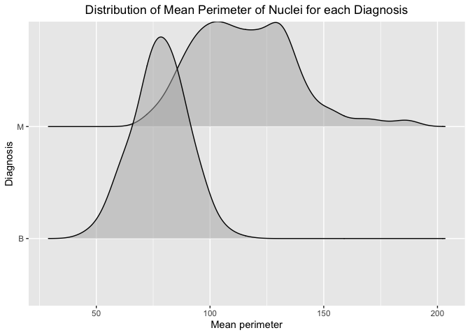<!-- -->

This plot allows us to see how the distribution of the mean perimeter of
nuclei present in the sample image differs for the two different types
of breast mass. In the plot, I customized the transparency so that the
distribution of the benign diagnosis doesn’t cover the malignant
distribution completely. By customizing the transparency, I was able to
make it so that we can view both distributions fully in one plot.

To answer our **second research question** regarding the relationship
between the worst variables and the diagnosis, we will start by looking
specifically at the symmetry variable. First we will find the mean,
variance, range and median of the mean symmetry variable across the two
diagnoses. We will then plot a histogram and find the optimal number of
bins.

**Task 1.**

``` r
cancer_sample %>%
  group_by(diagnosis) %>%
  summarize(mean(symmetry_worst), var(symmetry_worst), min(symmetry_worst),max(symmetry_worst), median(symmetry_worst))
```

    ## # A tibble: 2 × 6
    ##   diagnosis `mean(symmetry_worst)` `var(symmetry_worst)` min(s…¹ max(s…² media…³
    ##   <chr>                      <dbl>                 <dbl>   <dbl>   <dbl>   <dbl>
    ## 1 B                          0.270               0.00174   0.157   0.423   0.269
    ## 2 M                          0.323               0.00558   0.156   0.664   0.310
    ## # … with abbreviated variable names ¹​`min(symmetry_worst)`,
    ## #   ²​`max(symmetry_worst)`, ³​`median(symmetry_worst)`

Finding these summary statistics helps us begin to explore how the worst
symmetry variable differs for the two different types of diagnosis. This
is just looking at the symmetry variable but could be done for all worst
variables to obtain a better idea of which measurements differ between
the two diagnoses.

**Task 8.**

``` r
ggplot(cancer_sample, aes(symmetry_worst, colour = diagnosis)) +
  geom_histogram(bins=10) +
  labs(x="Worst symmetry", y="Count", title="Distribution of the Worst Symmetry") + 
  theme(plot.title = element_text(hjust = 0.5))
```

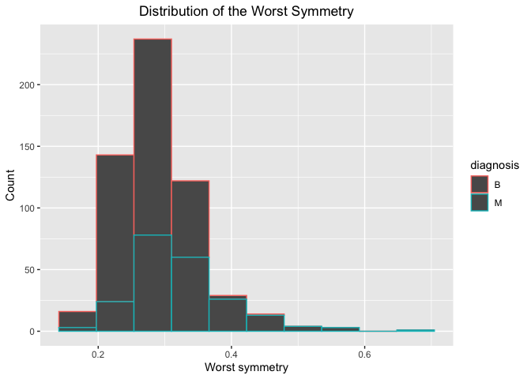<!-- -->

``` r
ggplot(cancer_sample, aes(symmetry_worst, colour = diagnosis)) +
  geom_histogram(bins=60) +
  labs(x="Worst symmetry", y="Count", title="Distribution of the Worst Symmetry") + 
  theme(plot.title = element_text(hjust = 0.5))
```

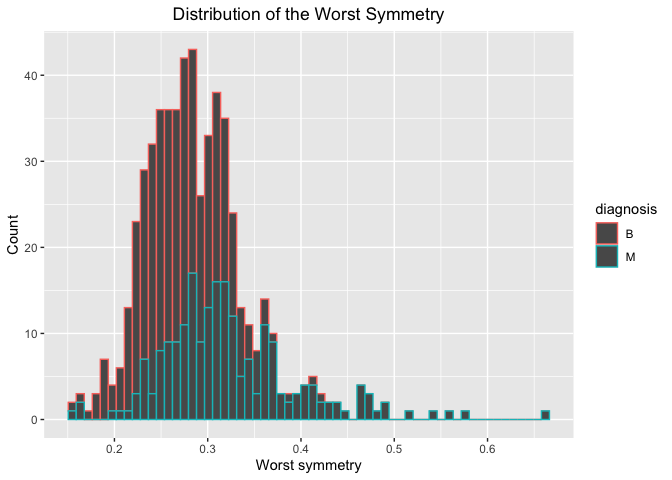<!-- -->

``` r
ggplot(cancer_sample, aes(symmetry_worst, colour = diagnosis)) +
  geom_histogram(bins=110) +
  labs(x="Worst symmetry", y="Count", title="Distribution of the Worst Symmetry") + 
  theme(plot.title = element_text(hjust = 0.5))
```

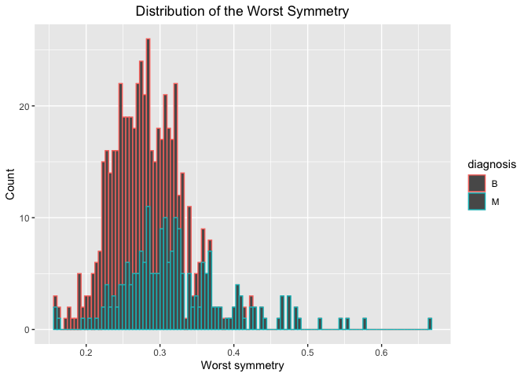<!-- -->

This plot show how the distribution of the largest/worst symmetry of
nuclei for the two different diagnoses. Looking at the distribution of
the largest symmetry of nuclei for the two different diagnoses can show
us if the worst symmetry differs for benign and malignant masses.
However, to analyze the histogram we want to make sure we have the
correct number of bins. Too many bins leads to a very jagged graph but
too few doesn’t portray the data properly. As seen in the code above, we
tried the graph with 10, 60 and 110 bins and the histogram with 60 bins
looks the best.

For our **third research question**, to look at whether the magnitude of
the standard error of a variable affects how well that variable predicts
the diagnosis, we will start by counting our observations for each type
of diagnosis. We will then create a graph out of summarized variables
that has at least two geom layers.

**Task 2.**

``` r
cancer_sample %>% 
 group_by(diagnosis) %>% 
 summarise( n = n())
```

    ## # A tibble: 2 × 2
    ##   diagnosis     n
    ##   <chr>     <int>
    ## 1 B           357
    ## 2 M           212

By computing the number of observations that we have for malignant and
benign diagnoses, we are able to make more accurate conclusions. For
example, if one type of diagnosis had significantly more observations
than the other, or if one didn’t have a sufficient amount of
observations some of our conclusions may not be accurate. To answer this
research question, in our future analysis, we need to know which
variables can be used to accurately predict diagnosis. For example, this
could be done using something like a test and training set of our data
and fitting a model meaning we need to ensure that we have enough of
each type of observation in order to make our test and training sets.

**Task 5.**

``` r
cancer_sample2 <- cancer_sample %>%
    group_by(diagnosis) %>%
    summarise(across(where(is.numeric), mean, na.rm = TRUE))
cancer_sample2
```

    ## # A tibble: 2 × 32
    ##   diagn…¹     ID radiu…² textu…³ perim…⁴ area_…⁵ smoot…⁶ compa…⁷ conca…⁸ conca…⁹
    ##   <chr>    <dbl>   <dbl>   <dbl>   <dbl>   <dbl>   <dbl>   <dbl>   <dbl>   <dbl>
    ## 1 B       2.65e7    12.1    17.9    78.1    463.  0.0925  0.0801  0.0461  0.0257
    ## 2 M       3.68e7    17.5    21.6   115.     978.  0.103   0.145   0.161   0.0880
    ## # … with 22 more variables: symmetry_mean <dbl>, fractal_dimension_mean <dbl>,
    ## #   radius_se <dbl>, texture_se <dbl>, perimeter_se <dbl>, area_se <dbl>,
    ## #   smoothness_se <dbl>, compactness_se <dbl>, concavity_se <dbl>,
    ## #   concave_points_se <dbl>, symmetry_se <dbl>, fractal_dimension_se <dbl>,
    ## #   radius_worst <dbl>, texture_worst <dbl>, perimeter_worst <dbl>,
    ## #   area_worst <dbl>, smoothness_worst <dbl>, compactness_worst <dbl>,
    ## #   concavity_worst <dbl>, concave_points_worst <dbl>, symmetry_worst <dbl>, …

``` r
cancer_sample3 <- cancer_sample2 %>% 
  select(c(-ID, -radius_worst, -texture_worst, -perimeter_worst, -area_worst, -smoothness_worst, -compactness_worst,-concavity_worst, -concave_points_worst,-symmetry_worst,-fractal_dimension_worst, -concave_points_mean, -fractal_dimension_mean,-concave_points_se, -fractal_dimension_se, -area_mean, -area_se, -radius_mean, -radius_se, -perimeter_mean, -perimeter_se,-texture_mean,-texture_se)) %>%
  pivot_longer(cols = c(-diagnosis), 
               names_to  = c("Type",".value"),
               names_sep = "_")
cancer_sample3
```

    ## # A tibble: 8 × 4
    ##   diagnosis Type          mean      se
    ##   <chr>     <chr>        <dbl>   <dbl>
    ## 1 B         smoothness  0.0925 0.00720
    ## 2 B         compactness 0.0801 0.0214 
    ## 3 B         concavity   0.0461 0.0260 
    ## 4 B         symmetry    0.174  0.0206 
    ## 5 M         smoothness  0.103  0.00678
    ## 6 M         compactness 0.145  0.0323 
    ## 7 M         concavity   0.161  0.0418 
    ## 8 M         symmetry    0.193  0.0205

``` r
ggplot(cancer_sample3, aes(mean,se,colour = Type)) +
  geom_point(aes(shape=diagnosis)) +
  geom_line(alpha=0.5) +
  labs(x="Mean", y="Standard error", title="Relationship between Mean and Standard Area of Measurements")+
  theme(plot.title = element_text(hjust = 0.5))
```

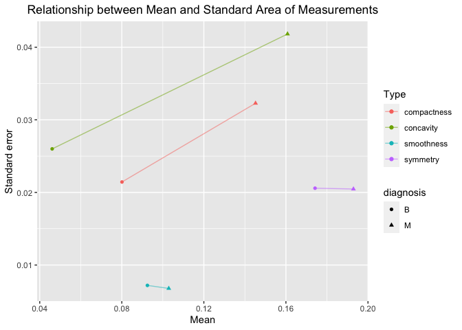<!-- -->

This plot shows the four variables with the smallest mean and standard
error. It also shows how they differ for the two diagnoses. The
different shaped points help distinguish the two diagnoses and the lines
are added so that it’s easy to see the relationship between the two
diagnoses. This can help us answer our question as we can see which have
the largest standard error and means, and if this differs for benign and
malignant.

To answer the **fourth research question** and explore the relationship
between the mean area of nuclei and the mean smoothness, we will create
a categorical variable from the smoothness_mean variable. We will then
create a plot and use a logarithmic axis since area_mean takes on a
large range of values.

**Task 3.**

``` r
cancer_sample_1 <- cancer_sample %>% 
  mutate(smoothness_mean_cat = case_when(smoothness_mean <= 0.06 ~ "Very smooth", 
                              smoothness_mean > 0.06 & smoothness_mean <=0.09 ~ "Smooth",
                              smoothness_mean > 0.09 & smoothness_mean <=0.12 ~ "Somewhat Smooth", 
                              smoothness_mean > 0.12 ~ "Not smooth"))
```

Creating this categorical variable allows us to split the mean
smoothness of nuclei present in a sample image into four categories.
This is helpful because we can use this new variable in different graphs
to explore the relationship with mean area as desired.

**Task 6.**

``` r
ggplot(cancer_sample_1, aes(smoothness_mean_cat,area_mean)) +
  geom_jitter() +
  scale_y_log10() +
  labs(x="Mean smoothness", y="Mean area", title="Relationship between Mean Smoothness and Mean Area") +
  theme(plot.title = element_text(hjust = 0.5))
```

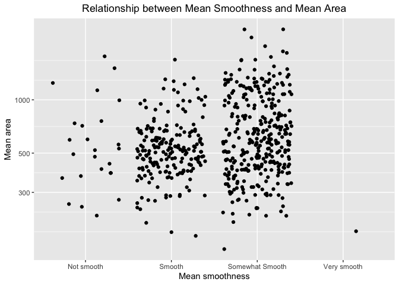<!-- -->

This plot helps us understand the relationship between smoothness and
mean area. The categorical variable helps us see if a pattern exists and
to see in which category most of our observations lie. The logarithmic
scale helps us see all the observations since they have a large range.

<!----------------------------------------------------------------------------->

### 1.2 (3 points)

Based on the operations that you’ve completed, how much closer are you
to answering your research questions? Think about what aspects of your
research questions remain unclear. Can your research questions be
refined, now that you’ve investigated your data a bit more? Which
research questions are yielding interesting results?

<!-------------------------- Start your work below ---------------------------->

Now that we have explored the data a bit more through various
summarizing and graphing methods, we can make some conclusions regarding
our four research questions.  

Through the various summary statistics about the mean perimeter and
density graph showing the different distributions for each diagnosis, we
are getting closer to answering our first research question. It’s still
very unclear whether our results are statistically significant, however
so far it’s interesting that each summary statistic is higher for the
malignant diagnosis than it is for the benign. Also we can see in the
graph that the distribution of the mean perimeter variable differ for
the two different diagnoses. Benign has a much higher peak with a lower
mean compared to the malignant distribution that are more spread out and
almost bimodal. As mentioned, it still remains unclear if this the mean
perimeter can predict the diagnosis, but so far it looks like the mean
perimeter is generally smaller for benign tumors and there’s less
variance than for malignant.  

For our second research question, we focused on the symmetry variable
but to answer our question we would need to look further into all
variables and their respective worst. The summary statistics showed that
there are some differences between the worst symmetry for benign and
malignant diagnoses. Then when we look at the histogram with 60 bins
it’s clear that the distribution of the symmetry worst variable is more
spread out for the malignant tumor whereas the benign tumors have a
clearer peak. A lot more analysis needs to be done for this question so
that all measurements can be taken into account. The symmetry worst
variable doesn’t differ greatly between benign and malignant tumors so
there’s overlap in the histogram, and if this is the case with other
worst variables then we could refine the question.  

Our third research question looks at the magnitude of the standard error
for each variable. Checking the number of observations for benign and
malignant is important so that we can check we have an accurate sample
size. In the graph we show both malignant and benign tumors so we needed
to check that the number of observations for each is similar so that we
can compare the two. The graph looks at just four variables and their
standard error, so in a further analysis we need to check the other
variables. The variables in the graph are the four variables with the
smallest mean and standard error so that we can see them all on the same
graph. The observations that have a malignant diagnosis have a higher
mean for all 4 variables so we can use this to see the relationship
between standard error and mean. Further analysis would then look into
if measurements with high standard errors should be used to predict the
diagnosis or not. This was a good start to answering the third research
question as we can see some mean variables have a positive relationship
with the standard error and high standard errors may not predict
diagnosis well, so these measurements could be avoided. Further research
would have to be done on the prediction of diagnosis.  

The fourth question looked at the relationship between two variables,
area and smoothness. If these variables are highly correlated, one might
not need to do measure both. Creating a categorical variable allows us
to create the jitter plot and look for a relationship between the two
variables. So far there doesn’t seem to be an obvious relationship but
further analysis can be done to see if they are both needed in a model
to predict diagnosis. This question could also be refined to look at
relationships between other variables.
<!----------------------------------------------------------------------------->

### Attribution

Thanks to Icíar Fernández Boyano for mostly putting this together, and
Vincenzo Coia for launching.
